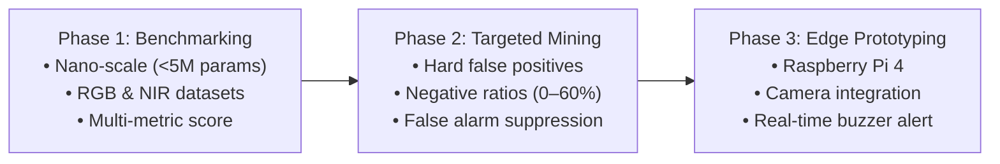

# Combating Cry-Wolf in Edge Driver Monitoring via Targeted Mining

<p align="center">
  
  
  
  
</p>

---

## 👥 Team Members

| Member | Student ID | Email | Program |
| :--- | :---: | :--- | :---: |
| **Oumar Mamoun Ibrahim** | U22200741 | [U22200741@sharjah.ac.ae](mailto:U22200741@sharjah.ac.ae) | CPE |
| **Abdullah Jafar Abdelhamid** | U23101327 | [U23101327@sharjah.ac.ae](mailto:U23101327@sharjah.ac.ae) | CPE |
| **Faris Munadhil Ahmed Alagha** | U23104246 | [U23104246@sharjah.ac.ae](mailto:U23104246@sharjah.ac.ae) | CPE |
| **Mohamed Ahmed Saad Khafagy** | U20101649 | [U20101649@sharjah.ac.ae](mailto:U20101649@sharjah.ac.ae) | CPE |

## 🎓 Supervisor

**Dr. Mohamad Khairi Bin Ishak**  
*Associate Professor, Department of Electrical and Computer Engineering — University of Sharjah*

[](mailto:mishak@sharjah.ac.ae)
[](https://orcid.org/0000-0002-3554-0061)
[](https://scholar.google.com/citations?user=yePUu3cAAAAJ&hl=en)
[](https://www.researchgate.net/profile/Mohamad-Khairi-Ishak-2?ev=prf_overview)

---

## 📌 Current Status & Milestones

> [!IMPORTANT]
> **Active Milestone: Literature Review**  
> The literature review template has been shared with team members.  
> 🗓️ **Submission Deadline:** `16-09-2026`  
> 📄 **Resource:** [Literature Review Template](docs/templates/SDPLitRevTemp.docx) | 📘 **Guide:** [SDP Guide](docs/guide/SDPGuide_Fall2025%20(1).pdf)

---

## 🔍 Problem Statement

As regulatory bodies increasingly mandate in-cabin Driver Monitoring Systems (DMS) [[1]](#ref-1) to reduce traffic collisions caused by drowsiness and distraction, edge deployment of lightweight vision models has become indispensable. However, edge DMS deployment encounters three fundamental bottlenecks:

1. **Downstream Operational Costs & Driver Nuisance:** Excessive false detections trigger the "cry-wolf" effect, causing driver annoyance and loss of trust.
2. **Strict Latency & Resource Constraints:** High vehicle velocities require tight inference latency budgets, while thermal and memory limitations preclude high-parameter, compute-heavy deep models.
3. **Dynamic Cabin Noise & Illumination Shifts:** Uncontrolled lighting across visible (RGB) and Near-Infrared (NIR) spectrums exacerbates false positive rates on edge vision architectures.

This creates a critical trade-off: larger server-grade networks suppress false detections effectively but cannot meet edge real-time and hardware constraints, whereas standard nano-detectors suffer from chronic false alarms.

---

## 📖 Overview

Driver drowsiness and inattention contribute to over 35% of all roadway fatalities [[2]](#ref-2). While in-cabin DMS can mitigate these dangers, conventional edge detectors frequently issue nuisance alarms, leading drivers to ignore or actively circumvent monitoring equipment [[3]](#ref-3).

The primary objective of this project is to develop an edge-optimized DMS that drastically curtails false alarms while retaining high sensitivity and real-time responsiveness. Instead of populating training sets with randomly selected negative frames, our approach leverages **targeted hard false-positive mining** to immunize models against common in-cabin distractors. The resulting model will be integrated into a physical prototype utilizing a **Raspberry Pi 4**, an RGB camera feed, and real-time audio/visual alert mechanisms.

---

## ⚙️ Methodology

Our engineering workflow is structured into three consecutive phases:



1. **Nano-Scale Model Benchmarking:**  
   Benchmark sub-5M parameter detector families (e.g., YOLO and D-FINE) across 30 FPS RGB and NIR video datasets (such as DMD and Drive&Act). Models are evaluated on localized inattention behaviors (e.g., yawning, eating, drinking) using an equally-weighted composite score (mAP@50, macro-F1, FPS, and false detections per 1,000 frames) to isolate optimal architectures.

2. **Targeted False-Positive Mining & Calibration:**  
   Calibrate negative-to-positive frame ratios (0%, 20%, 40%, 60%) and substitute randomly sampled background frames with targeted, mined hard false positives to suppress nuisance detections systematically.

3. **Embedded Prototype Deployment:**  
   Deploy optimized model weights onto a Raspberry Pi 4 embedded platform interfaced with an RGB camera module and an alert mechanism (buzzer/indicator) to validate real-time in-cabin performance.

---

## 🎯 Deliverables

- 📄 **Engineering & Research Report:** Comprehensive documentation detailing the literature review, dataset curation strategy, benchmark evaluations, and embedded deployment results.
- 🧠 **Optimized Nano-Scale Model Weights:** Ready-to-deploy weights for DMS edge deployment trained on curated hard-negative datasets to minimize false alarms.
- 🛠️ **Physical Embedded Prototype:** A functional Raspberry Pi 4-based embedded system featuring live camera input and responsive alerting for real-time driver monitoring.

---

## 📊 Models Considered & Benchmark Results

The following benchmark comparisons reflect evaluation on subject-disjoint driver monitoring datasets [[4]](#ref-4).

### Visible Spectrum (RGB)
*Primary candidate:* **[YOLO11n](https://docs.ultralytics.com/models/yolo11/)** ([Ultralytics Repository](https://github.com/ultralytics/ultralytics) | [Pretrained Weights](https://github.com/ultralytics/assets/releases/download/v8.3.0/yolo11n.pt))

| Model | Overall Normalized Score |
| :--- | :---: |
| **YOLO11n** | **70.93** |
| YOLO26n | 53.60 |
| D-FINE-N | 29.68 |

### Near-Infrared Spectrum (NIR)
*Primary candidate:* **[YOLOv8n](https://docs.ultralytics.com/models/yolov8/)** ([Ultralytics Repository](https://github.com/ultralytics/ultralytics) | [Pretrained Weights](https://github.com/ultralytics/assets/releases/download/v8.3.0/yolov8n.pt))

| Model | Overall Normalized Score |
| :--- | :---: |
| **YOLOv8n** | **89.50** |
| RT-DETRv2-S | 75.65 |
| D-FINE-N | 70.72 |
| YOLO11n | 51.12 |
| YOLO26n | 46.43 |

> [!NOTE]
> *Overall normalized scores are computed using an equally-weighted combination of mAP@50, macro-F1, throughput (FPS), and false alarms per 1,000 frames. For full benchmarking methodology, refer to [[4]](#ref-4).*

---

## 📁 Repository Structure

```text
├── README.md               # Project documentation and benchmark summary
├── docs/
│   ├── guide/              # Senior Design Project guidelines
│   │   └── SDPGuide_Fall2025 (1).pdf
│   ├── templates/          # Official report & literature review templates
│   │   ├── SDPLitRevTemp.docx
│   │   └── Report_Template_SDP1_Updated_Fall_2022 (4).docx
│   ├── references/         # Foundational research papers & benchmark manuscripts
│   │   └── to_start_with/
│   │       ├── manuscript.pdf
│   │       ├── thesis_final.pdf
│   │       └── ...
│   ├── PDFs/               # Compiled project reports (to be populated)
│   └── report/             # Report source documents
```

---

## 📚 References

- <a id="ref-1"></a>**[1]** F. Lyrheden, *"How Driver Monitoring Systems (DMS) Are Being Made Mandatory in 18 Million European Cars,"* Smart Eye, Apr. 28, 2023. [Online]. Available: [smarteye.se](https://smarteye.se/blog/the-general-safety-regulations-gsr-and-driver-monitoring-systems-dms/). [Accessed: Sep. 6, 2026].
- <a id="ref-2"></a>**[2]** G. Merlhiot and M. Bueno, *"How drowsiness and distraction can interfere with take-over performance: A systematic and meta-analysis review,"* Accident Analysis & Prevention, vol. 170, Art. no. 106536, Jun. 2022. doi: [10.1016/j.aap.2021.106536](https://doi.org/10.1016/j.aap.2021.106536).
- <a id="ref-3"></a>**[3]** F. Lambert, *"Chinese drivers are using plastic heads to fool Tesla’s Autopilot cabin camera,"* Electrek, Jun. 15, 2026. [Online]. Available: [electrek.co](https://electrek.co/2026/06/15/chinese-drivers-plastic-heads-fool-tesla-autopilot-camera/). [Accessed: Sep. 6, 2026].
- <a id="ref-4"></a>**[4]** O. M. Ibrahim, M. K. bin Ishak, K. Ammar, and N. M. Mirza, *"Lightweight Object Detection for Driver Monitoring: A Subject-Disjoint Benchmark,"* [Available in Repository](docs/references/to_start_with/manuscript.pdf).
