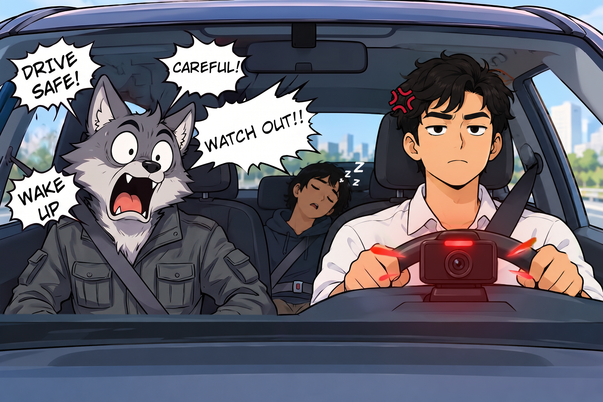
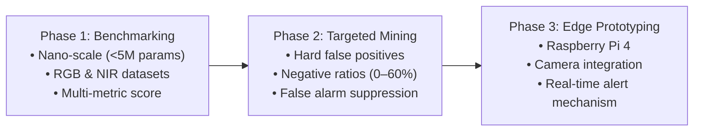

<h1 align="center">Design and Implementation of an Edge Based Driver Monitoring System with False Alarm Reduction</h1>

<p align="center" dir="rtl">
  <strong>تصميم وتنفيذ نظام مراقبة للسائق قائم على الحوسبة الطرفية مع الحد من الإنذارات الخاطئة</strong>
</p>

<p align="center">
  
  
  
  
  
  
</p>

<p align="center">
  
</p>

---

## Project Information

- **Institution:** University of Sharjah
- **College:** College of Computing and Informatics
- **Department:** Computer Engineering Department
- **Project Track:** Hardware / Embedded Systems & AI / Robotics
- **Academic Year:** Fall 2026–2027

---

## Team Members

| Member | Student ID | Email | Major |
| :--- | :---: | :--- | :---: |
| **Oumar Mamoun Ibrahim** | U22200741 | [U22200741@sharjah.ac.ae](mailto:U22200741@sharjah.ac.ae) | CPE |
| **Abdullah Jafar Abdelhamid** | U23101327 | [U23101327@sharjah.ac.ae](mailto:U23101327@sharjah.ac.ae) | CPE |
| **Faris Munadhil Ahmed Alagha** | U23104246 | [U23104246@sharjah.ac.ae](mailto:U23104246@sharjah.ac.ae) | CPE |
| **Mohamed Ahmed Saad Khafagy** | U20101649 | [U20101649@sharjah.ac.ae](mailto:U20101649@sharjah.ac.ae) | CPE |

## Supervisor

**Dr. Mohamad Khairi Bin Ishak**  
*Associate Professor, Department of Computer Engineering — College of Computing and Informatics, University of Sharjah*

[](mailto:mishak@sharjah.ac.ae)
[](https://orcid.org/0000-0002-3554-0061)
[](https://scholar.google.com/citations?user=yePUu3cAAAAJ&hl=en)
[](https://www.researchgate.net/profile/Mohamad-Khairi-Ishak-2?ev=prf_overview)

---

## Current Status & Milestones

> [!IMPORTANT]
> **Active Milestone: Literature Review**  
> The literature review template has been shared with team members.  
> **Submission Deadline:** `16-09-2026`  
> **Resource:** [Literature Review Template](docs/templates/SDPLitRevTemp.docx) | **Guide:** [SDP Guide](docs/guide/SDPGuide_Fall2025%20(1).pdf)

---

## Problem Statement

As countries increasingly mandate the usage of in-cabin Driver Monitoring Systems (DMS) [[1]](#ref-1) aiming to minimize accidents caused by driver drowsiness and distraction, edge deployment of lightweight vision models has become essential. However, edge system deployment faces three core bottlenecks:

1. **False Alerts & Driver Trust:** False detections can trigger unnecessary alerts and downstream operations, potentially reducing driver trust and system reliability.
2. **Latency & Resource Constraints:** Real-time monitoring requires low inference latency, while limited computational resources, memory, power, and thermal capacity restrict the use of computationally intensive models on edge devices.
3. **Dynamic Cabin Conditions & Illumination:** Variations in cabin conditions and visible (RGB) and Near-Infrared (NIR) illumination can affect model performance and increase susceptibility to false detections.

This introduces a clear tradeoff: Higher compute systems effectively minimize false detections, yet their footprint renders them infeasible in real-time deployment. Overall, this project addresses this challenge through lightweight object detection, hard negative mining, and embedded system implementation.

---

## Project Summary, Importance & Objectives

Drowsiness and distraction are major factors of road crashes and contribute to more than 35% of road fatalities [[2]](#ref-2). While in-cabin Driver Monitoring Systems (DMS) help to reduce these risks, these systems frequently produce nuisance false alarms, which undermine driver trust, encouraging the driver to circumvent the monitoring system [[3]](#ref-3).

### Objectives

1. **Lightweight Vision Benchmarking:** Evaluate lightweight object detection models using RGB and NIR driver monitoring datasets.
2. **Dataset Calibration & Hard Negative Mining:** Investigate negative sample ratios and hard negative mining for reducing false detections while maintaining detection performance.
3. **Embedded Prototype Implementation:** Deploy the selected model on a Raspberry Pi-based prototype integrating a camera and alert mechanism.

The final system will be evaluated using detection accuracy, F1 score, false detections per 1,000 negative frames, inference latency, and frame rate. The project combines AI model development, dataset optimization, embedded implementation, and real-time system evaluation.

---

## Methodology

Our engineering workflow is structured into three consecutive phases:



1. **Nano-Scale Model Benchmarking:**  
   Benchmark nano-scale (<5M parameters) detection families, such as D-FINE and YOLO, across RGB and NIR in-cabin 30 FPS video datasets (such as DMD and Drive&Act). Models are evaluated on localized (not temporal) inattention cues (e.g., yawning, eating, drinking) using an equally-weighted normalized score (mAP@50, macro-F1, FPS, false detections per 1,000 frames) to render the optimal model that balances accuracy, detection, and latency.

2. **Dataset Calibration & Hard Negative Mining:**  
   Calibrate the dataset across negative-to-positive frame ratios (0%, 20%, 40%, 60%) and curate the dataset with hard false positives instead of random negative frames to suppress false detections.

3. **Edge Optimization & Real-Time Prototyping:**  
   The selected lightweight model will be optimized and deployed on a Raspberry Pi-based edge platform integrated with an RGB camera and real-time alert mechanism. The complete embedded system will be experimentally evaluated in terms of inference speed, processing latency, detection reliability, false alarm rate, and overall real-time performance under representative driver monitoring conditions.

---

## Expected Outcomes & Deliverables

| Outcome Type | Selected | Description |
| :--- | :---: | :--- |
| **Physical Prototype** | Yes | Raspberry Pi 4-based embedded system with real-time RGB camera feed and alert mechanism |
| **Research Paper** | Yes | Benchmark evaluation, dataset curation methodology, and edge deployment findings |
| **Software Module** | Yes | Optimized lightweight detection weights and inference pipeline tailored for edge hardware |
| **Simulation Demo** | — | — |

The project delivers three main outcomes:

- **Technical Report & Literature Review:** A comprehensive report covering the literature review, dataset curation methodology, and embedded deployment results.
- **Optimized Lightweight Model:** An optimized lightweight object detection model for edge-based Driver Monitoring Systems, trained using curated data to reduce false detections while maintaining reliable detection performance.
- **Functional Embedded Physical Prototype:** A prototype implemented on a Raspberry Pi 4, integrating a real-time RGB camera, edge AI inference, and an alert mechanism for in-cabin driver monitoring. The prototype demonstrates the practical feasibility of deploying lightweight AI models for reliable, real-time driver monitoring on resource-constrained edge hardware.

---

## Models Considered & Benchmark Results

The following benchmark comparisons reflect evaluation on subject-disjoint driver monitoring datasets [[4]](#ref-4).

### Visible Spectrum (RGB)
*Primary candidate:* **[YOLO11n](https://docs.ultralytics.com/models/yolo11/)** ([Ultralytics Repository](https://github.com/ultralytics/ultralytics) | [Pretrained Weights](https://github.com/ultralytics/assets/releases/download/v8.3.0/yolo11n.pt))

| Model | Overall Normalized Score |
| :--- | :---: |
| **YOLO11n** | **70.93** |
| YOLO26n | 53.60 |
| D-FINE-N | 29.68 |

### Near-Infrared Spectrum (NIR)
*Primary candidate:* **[YOLOv8n](https://docs.ultralytics.com/models/yolov8/)** ([Ultralytics Repository](https://github.com/ultralytics/ultralytics) | [Pretrained Weights](https://github.com/ultralytics/assets/releases/download/v8.3.0/yolov8n.pt))

| Model | Overall Normalized Score |
| :--- | :---: |
| **YOLOv8n** | **89.50** |
| RT-DETRv2-S | 75.65 |
| D-FINE-N | 70.72 |
| YOLO11n | 51.12 |
| YOLO26n | 46.43 |

> [!NOTE]
> *Overall normalized scores are computed using an equally-weighted combination of mAP@50, macro-F1, throughput (FPS), and false alarms per 1,000 frames. For full benchmarking methodology, refer to [[4]](#ref-4).*

---

## Repository Structure

```text
├── README.md               # Project documentation and benchmark summary
├── comic.png               # Conceptual illustration of driver false alarm fatigue
├── docs/
│   ├── guide/              # Senior Design Project guidelines
│   │   └── SDPGuide_Fall2025 (1).pdf
│   ├── templates/          # Official report & literature review templates
│   │   ├── SDPLitRevTemp.docx
│   │   └── Report_Template_SDP1_Updated_Fall_2022 (4).docx
│   ├── references/         # Foundational research papers & benchmark manuscripts
│   │   └── to_start_with/
│   │       ├── manuscript.pdf
│   │       ├── thesis_final.pdf
│   │       └── ...
│   ├── PDFs/               # Compiled project reports (to be populated)
│   └── report/             # Report source documents
```

---

## References

- <a id="ref-1"></a>**[1]** F. Lyrheden, *"How Driver Monitoring Systems (DMS) Are Being Made Mandatory in 18 Million European Cars,"* Smart Eye, Apr. 28, 2023. [Online]. Available: [smarteye.se](https://smarteye.se/blog/the-general-safety-regulations-gsr-and-driver-monitoring-systems-dms/). [Accessed: Sep. 6, 2026].
- <a id="ref-2"></a>**[2]** G. Merlhiot and M. Bueno, *"How drowsiness and distraction can interfere with take-over performance: A systematic and meta-analysis review,"* Accident Analysis & Prevention, vol. 170, Art. no. 106536, Jun. 2022. doi: [10.1016/j.aap.2021.106536](https://doi.org/10.1016/j.aap.2021.106536).
- <a id="ref-3"></a>**[3]** F. Lambert, *"Chinese drivers are using plastic heads to fool Tesla’s Autopilot cabin camera,"* Electrek, Jun. 15, 2026. [Online]. Available: [electrek.co](https://electrek.co/2026/06/15/chinese-drivers-plastic-heads-fool-tesla-autopilot-camera/). [Accessed: Sep. 6, 2026].
- <a id="ref-4"></a>**[4]** O. M. Ibrahim, M. K. bin Ishak, K. Ammar, and N. M. Mirza, *"Lightweight Object Detection for Driver Monitoring: A Subject-Disjoint Benchmark,"* [Available in Repository](docs/references/to_start_with/manuscript.pdf).
